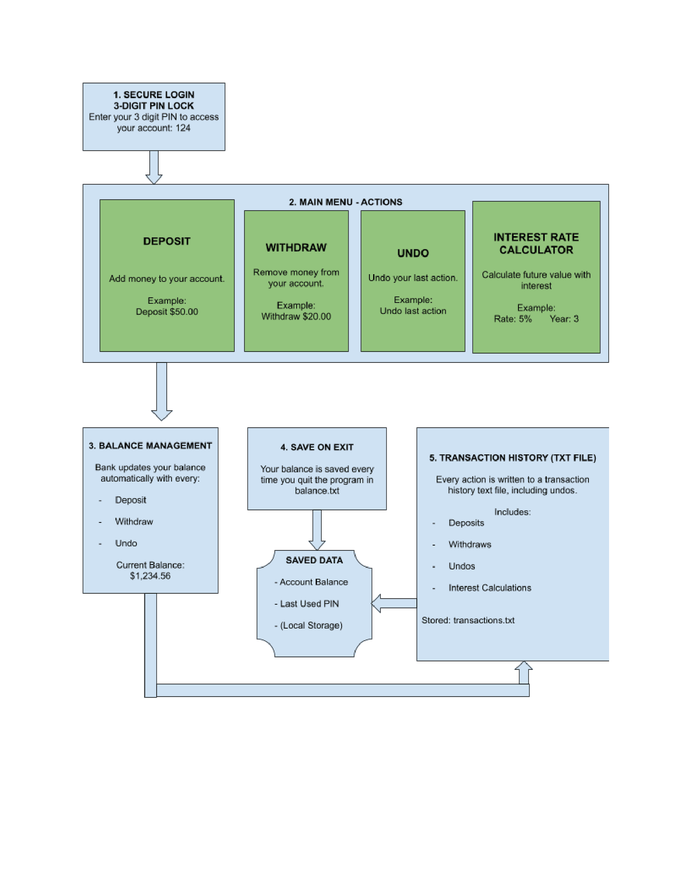

## Diagram Explanation

The diagram displays a flowchart of BroBank, showing a console banking application that allows users to securely manager their account with deposits, withdraws, undos, and an interest rate calculator. Your balance is updated in real time, saved when you quit, and every transaction (including undos) is written to a history text file. It connects to my implementation by guiding viewers into a common session flow of that they might experience when using the app.

## Diagram Link

